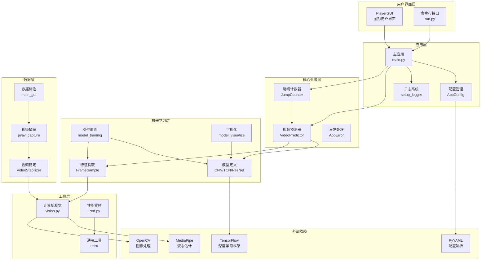
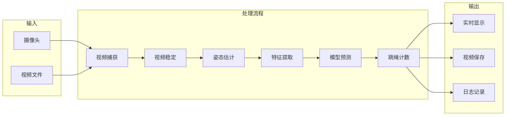
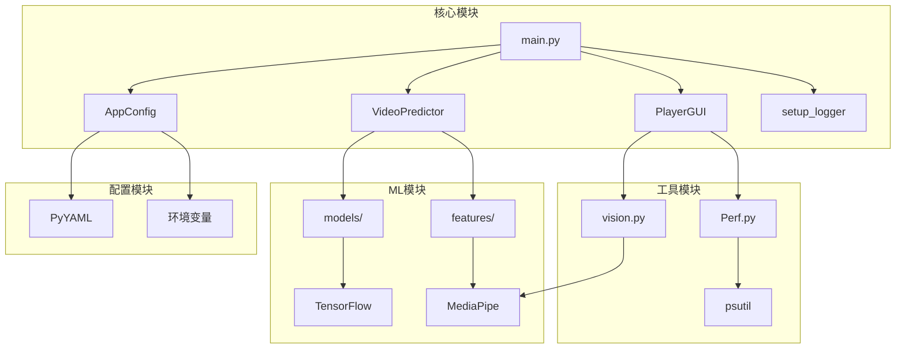
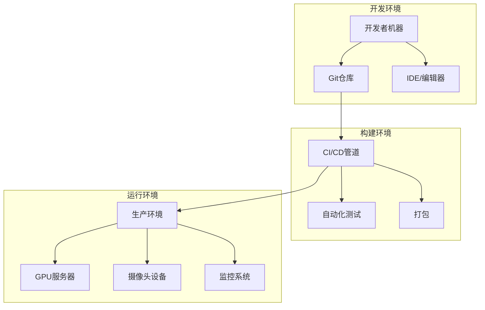
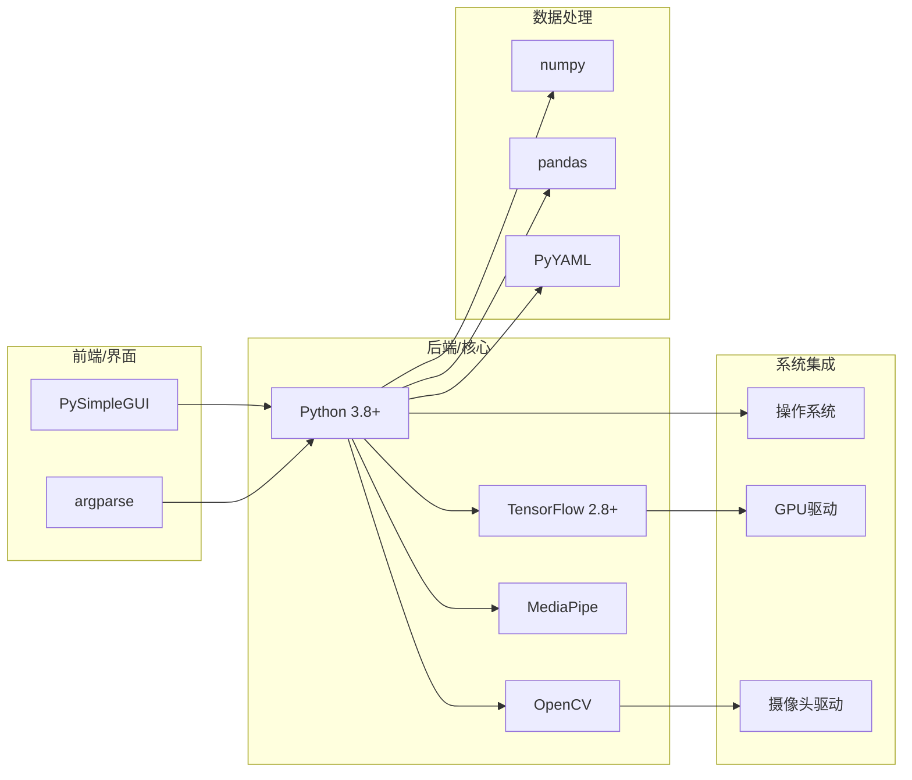
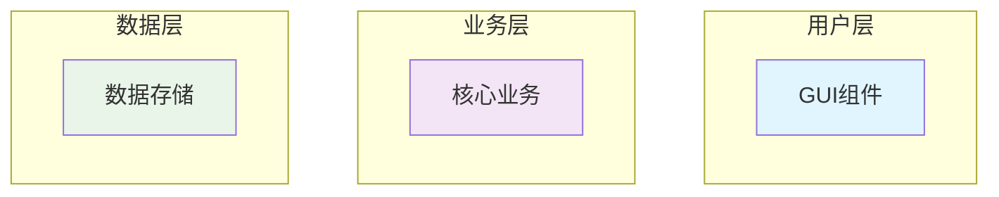

# RopeJumpCounter 系统架构

## 整体架构图



## 数据流架构



## 模块依赖关系



## 部署架构



## 技术栈架构



## 如何使用这些架构图

### 1. **在 GitHub 中查看**
GitHub 原生支持 Mermaid 图表，直接在 Markdown 中显示。

### 2. **在文档中引用**
```markdown
## 系统概述
请参考 [架构图](./ARCHITECTURE.md#整体架构图) 了解系统结构。
```

### 3. **导出为图片**
可以使用 Mermaid CLI 工具导出为 PNG/SVG：
```bash
# 安装 mermaid-cli
npm install -g @mermaid-js/mermaid-cli

# 导出图片
mmdc -i architecture.md -o architecture.png
```

### 4. **在线编辑器**
- [Mermaid Live Editor](https://mermaid.live/)
- [Draw.io](https://draw.io/) (支持 Mermaid)

## 架构图的最佳实践

### 1. **分层清晰**
- 用户界面层
- 应用层
- 业务逻辑层
- 数据访问层

### 2. **颜色编码**


### 3. **保持更新**
- 代码变更时同步更新架构图
- 定期审查架构图的准确性
- 版本控制架构图

这样您就有了一个完整的系统架构文档！您觉得哪种图表最有用？我可以帮您进一步优化或添加其他类型的架构图。 