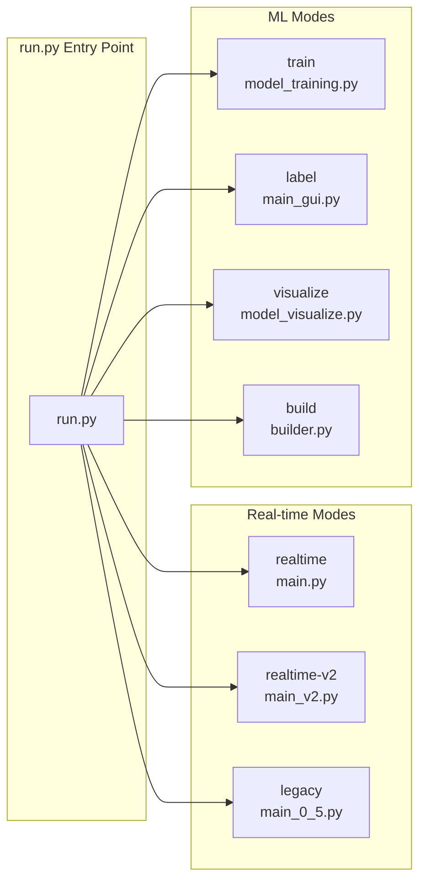
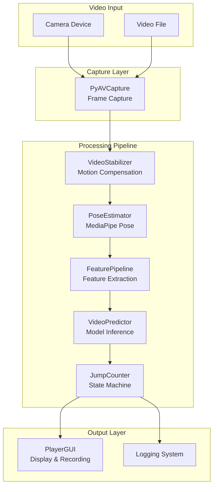
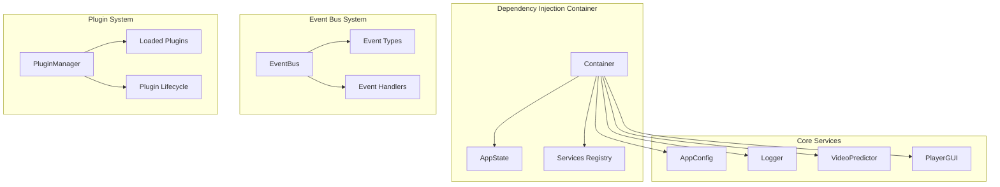
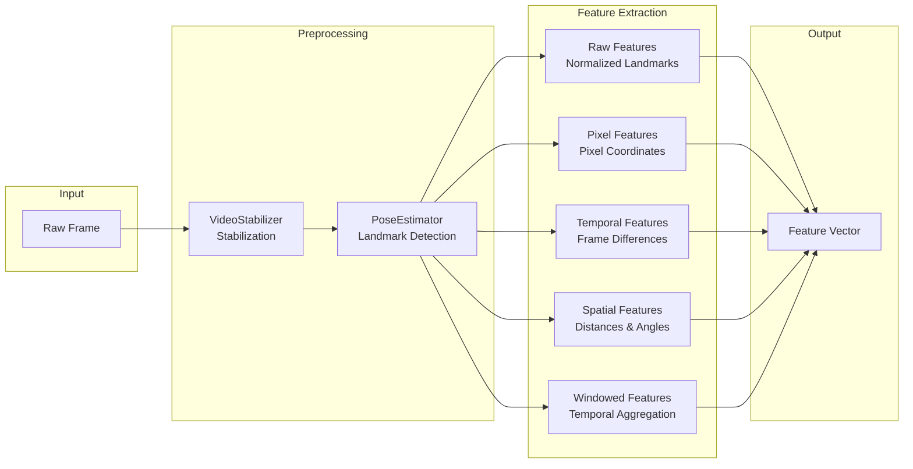
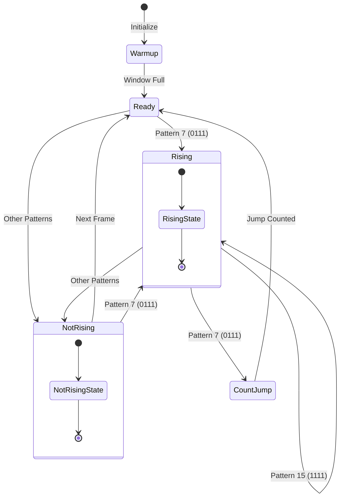
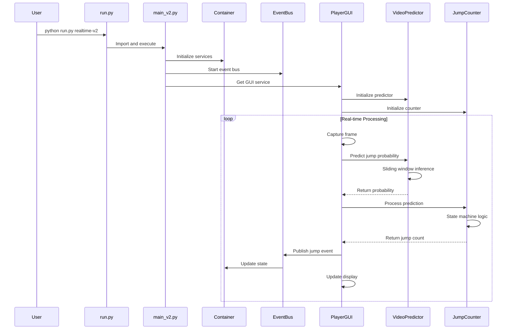
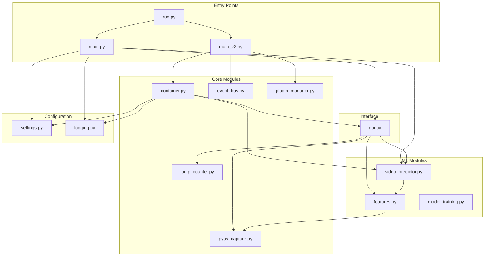
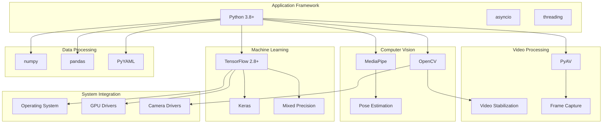
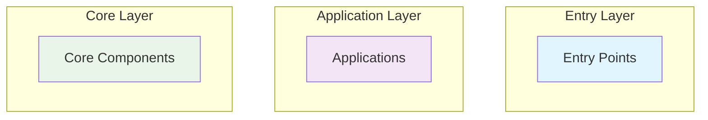

# RopeJumpCounter System Architecture

## Overall Architecture

```mermaid
graph TB
    subgraph "Entry Point Layer"
        RUN[run.py<br/>Main Entry Point]
    end
    
    subgraph "Application Layer"
        MAIN[main.py<br/>Original App]
        MAINV2[main_v2.py<br/>New Architecture]
        LEGACY[main_0_5.py<br/>Legacy App]
    end
    
    subgraph "Core Architecture (v2.0)"
        CONTAINER[Container<br/>Dependency Injection]
        EVENTBUS[EventBus<br/>Event System]
        PLUGIN[PluginManager<br/>Plugin System]
    end
    
    subgraph "Interface Layer"
        GUI[PlayerGUI<br/>Main Interface]
    end
    
    subgraph "Core Business Logic"
        PREDICTOR[VideoPredictor<br/>Model Inference]
        COUNTER[JumpCounter<br/>State Machine]
        FEATURE[FeaturePipeline<br/>Feature Extraction]
    end
    
    subgraph "Data Processing"
        CAPTURE[PyAVCapture<br/>Video Capture]
        STABILIZER[VideoStabilizer<br/>Video Stabilization]
        POSE[PoseEstimator<br/>MediaPipe Integration]
    end
    
    subgraph "Machine Learning"
        MODELS[Model Files<br/>Trained Models]
        TRAINING[model_training.py<br/>Training Script]
        VIZ[model_visualize.py<br/>Visualization]
    end
    
    subgraph "Data Management"
        LABELING[main_gui.py<br/>Annotation Tool]
        BUILDER[builder.py<br/>Dataset Builder]
    end
    
    subgraph "Configuration & Utilities"
        CONFIG[AppConfig<br/>Configuration]
        LOGGER[setup_logger<br/>Logging]
        PERF[PerfStats<br/>Performance]
    end
    
    %% Entry point connections
    RUN --> MAIN
    RUN --> MAINV2
    RUN --> LEGACY
    RUN --> TRAINING
    RUN --> LABELING
    RUN --> VIZ
    RUN --> BUILDER
    
    %% v2.0 architecture connections
    MAINV2 --> CONTAINER
    MAINV2 --> EVENTBUS
    MAINV2 --> PLUGIN
    
    %% Core business logic
    GUI --> PREDICTOR
    GUI --> COUNTER
    GUI --> FEATURE
    GUI --> CAPTURE
    
    %% Data processing pipeline
    FEATURE --> STABILIZER
    FEATURE --> POSE
    CAPTURE --> STABILIZER
    
    %% ML connections
    PREDICTOR --> MODELS
    TRAINING --> MODELS
    
    %% Configuration
    CONTAINER --> CONFIG
    CONTAINER --> LOGGER
    GUI --> PERF
```



## Application Modes Architecture



## Real-time Processing Pipeline



## v2.0 Architecture Components



## Feature Extraction Pipeline



## Jump Detection State Machine



## Data Flow Architecture



## Module Dependencies



## Technology Stack



## How to Use These Architecture Diagrams

### 1. **View in GitHub**
GitHub natively supports Mermaid diagrams, displaying them directly in Markdown.

### 2. **Reference in Documentation**
```markdown
## System Overview
Please refer to the [Architecture Diagram](ARCHITECTURE.md#overall-architecture) for system structure.
```

### 3. **Export as Images**
Use Mermaid CLI tool to export as PNG/SVG:
```bash
# Install mermaid-cli
npm install -g @mermaid-js/mermaid-cli

# Export images
mmdc -i ARCHITECTURE.md -o architecture.png
```

### 4. **Online Editors**
- [Mermaid Live Editor](https://mermaid.live/)
- [Draw.io](https://draw.io/) (supports Mermaid)

## Architecture Diagram Best Practices

### 1. **Clear Layering**
- Entry Point Layer
- Application Layer
- Core Architecture Layer
- Interface Layer
- Business Logic Layer
- Data Processing Layer

### 2. **Color Coding**


### 3. **Keep Updated**
- Synchronize architecture diagrams when code changes
- Regularly review diagram accuracy
- Version control architecture diagrams
