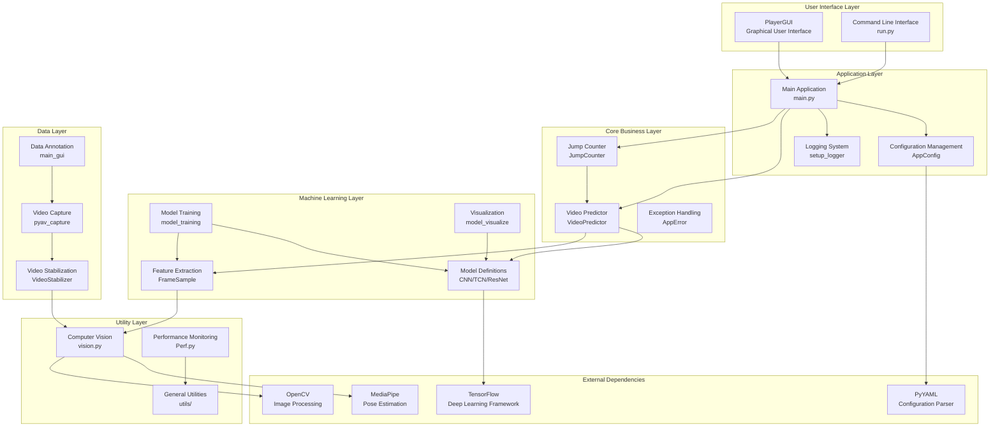
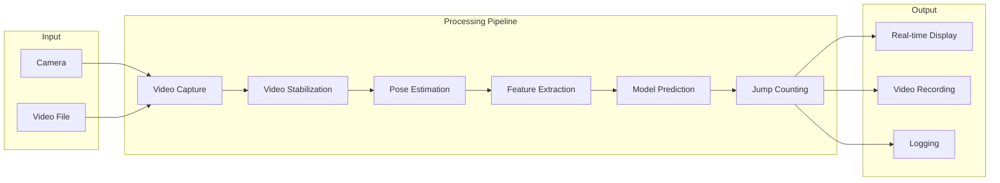
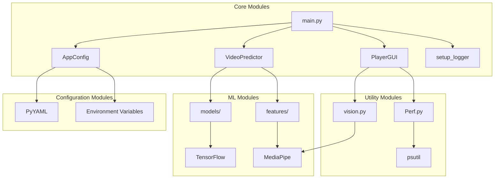
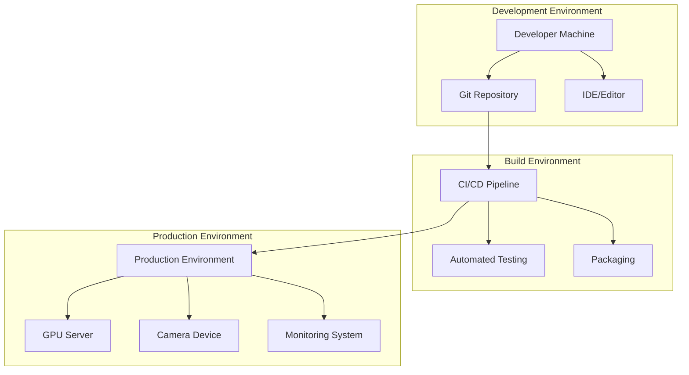
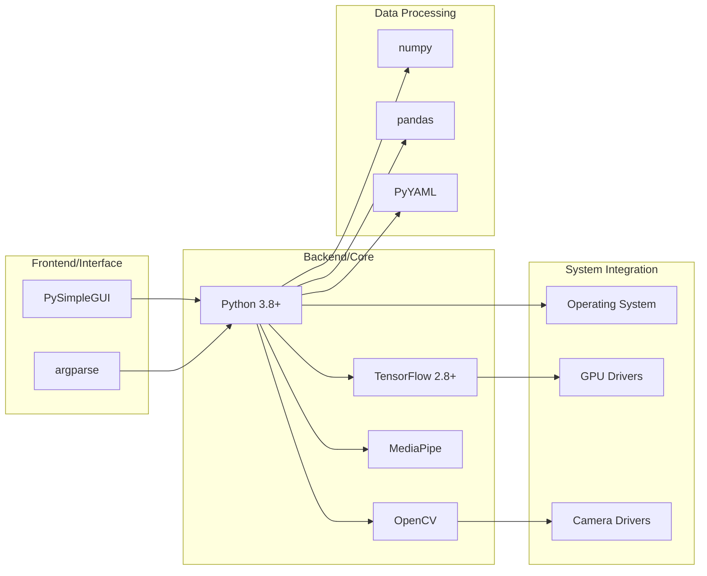
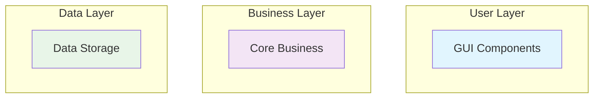

# RopeJumpCounter System Architecture

## Overall Architecture



## Data Flow Architecture



## Module Dependency Relationships



## Deployment Architecture



## Technology Stack Architecture



## How to Use These Architecture Diagrams

### 1. **View in GitHub**
GitHub natively supports Mermaid diagrams, displaying them directly in Markdown.

### 2. **Reference in Documentation**
```markdown
## System Overview
Please refer to the [Architecture Diagram](./ARCHITECTURE_EN.md#overall-architecture) for system structure.
```

### 3. **Export as Images**
Use Mermaid CLI tool to export as PNG/SVG:
```bash
# Install mermaid-cli
npm install -g @mermaid-js/mermaid-cli

# Export images
mmdc -i architecture_en.md -o architecture_en.png
```

### 4. **Online Editors**
- [Mermaid Live Editor](https://mermaid.live/)
- [Draw.io](https://draw.io/) (supports Mermaid)

## Architecture Diagram Best Practices

### 1. **Clear Layering**
- User Interface Layer
- Application Layer
- Business Logic Layer
- Data Access Layer

### 2. **Color Coding**


### 3. **Keep Updated**
- Synchronize architecture diagrams when code changes
- Regularly review diagram accuracy
- Version control architecture diagrams

This provides you with a complete system architecture documentation in English! Which type of diagram do you find most useful? I can help you further optimize or add other types of architecture diagrams. 