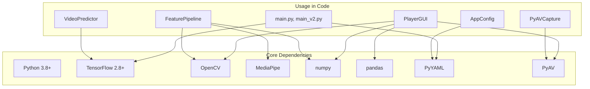
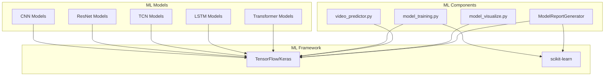
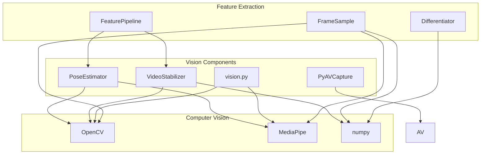
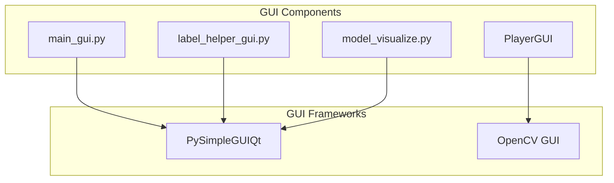
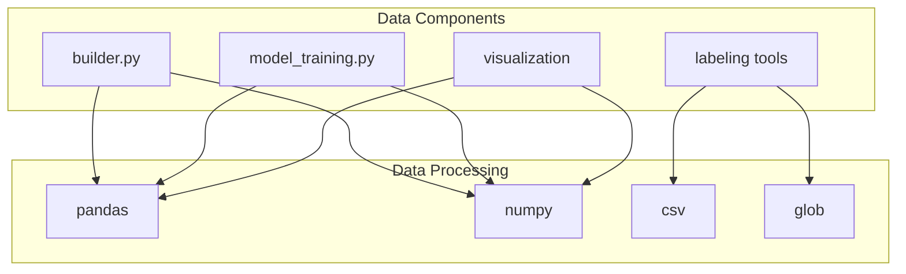
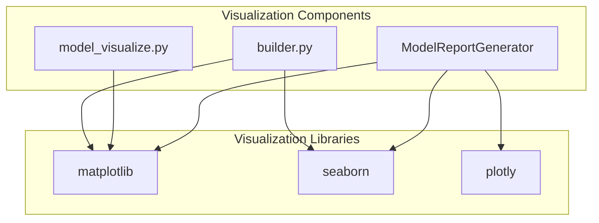
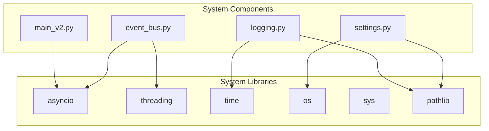

# Dependency Management Guide

## Overview

The RopeJumpCounter project uses a comprehensive set of dependencies for real-time jump rope counting, machine learning, computer vision, and data processing. This guide provides accurate dependency information based on actual code analysis.

## Actual Dependencies Found in Code

### Core Dependencies (Required for Basic Functionality)



### Machine Learning Dependencies



### Computer Vision Dependencies



### GUI Dependencies



### Data Processing Dependencies



### Visualization Dependencies



### System and Async Dependencies



## Dependency Usage by Module

### Entry Points
- **run.py**: argparse, sys, pathlib
- **main.py**: tensorflow, yaml, logging
- **main_v2.py**: asyncio, tensorflow, yaml, logging

### Core Modules
- **container.py**: yaml, logging
- **event_bus.py**: asyncio, threading, logging
- **plugin_manager.py**: yaml, logging
- **jump_counter.py**: (no external dependencies)
- **pyav_capture.py**: av, time

### Interface Modules
- **gui.py**: cv2, numpy, pandas, time, pathlib
- **main_gui.py**: PySimpleGUIQt, cv2, csv, os, glob
- **label_helper_gui.py**: PySimpleGUIQt, cv2, csv, numpy, base64

### ML Modules
- **video_predictor.py**: tensorflow, numpy, pathlib
- **model_training.py**: tensorflow, pandas, matplotlib, sklearn
- **model_visualize.py**: tensorflow, cv2, numpy, pandas, matplotlib, PySimpleGUI
- **features.py**: numpy, mediapipe, cv2

### Data Processing Modules
- **builder.py**: cv2, pandas, numpy, matplotlib, seaborn
- **feature_mode.py**: enum
- **FrameSample.py**: cv2, mediapipe, numpy, time, collections

### Visualization Modules
- **ModelReportGenerator.py**: pandas, numpy, sklearn, plotly, matplotlib, seaborn

## Installation Recommendations

### Minimal Installation (Core Functionality)
```bash
pip install tensorflow opencv-python mediapipe numpy pandas PyYAML av
```

### Complete Installation (All Features)
```bash
pip install tensorflow opencv-python mediapipe numpy pandas PyYAML av
pip install PySimpleGUIQt scikit-learn matplotlib seaborn plotly
```

### Development Installation (With Tools)
```bash
pip install tensorflow opencv-python mediapipe numpy pandas PyYAML av
pip install PySimpleGUIQt scikit-learn matplotlib seaborn plotly
pip install pytest black flake8 mypy jupyter
```

## Version Compatibility

### Core Dependencies
- **Python**: 3.8+
- **TensorFlow**: 2.8+
- **OpenCV**: 4.5+
- **MediaPipe**: 0.8+
- **NumPy**: 1.19+
- **Pandas**: 1.3+
- **PyYAML**: 5.4+
- **PyAV**: 9.0+

### Optional Dependencies
- **PySimpleGUIQt**: 5.0+
- **scikit-learn**: 1.0+
- **matplotlib**: 3.3+
- **seaborn**: 0.11+
- **plotly**: 5.0+

## Platform-Specific Dependencies

### macOS
- **PyAV**: Uses AVFoundation for camera access
- **OpenCV**: Standard installation
- **MediaPipe**: Native support

### Linux
- **PyAV**: Uses V4L2 for camera access
- **OpenCV**: May require additional system packages
- **MediaPipe**: Native support

### Windows
- **PyAV**: Uses DirectShow for camera access
- **OpenCV**: Standard installation
- **MediaPipe**: Native support

## Dependency Conflicts and Solutions

### Common Issues

#### 1. OpenCV vs PyAV Camera Access
```bash
# Use PyAV for low-latency capture (recommended)
pip install av

# Fallback to OpenCV if PyAV fails
pip install opencv-python
```

#### 2. TensorFlow GPU Support
```bash
# For GPU acceleration
pip install tensorflow-gpu

# For CPU only
pip install tensorflow
```

#### 3. GUI Framework Conflicts
```bash
# Use PySimpleGUIQt for annotation tools
pip install PySimpleGUIQt

# OpenCV GUI for main application (included with opencv-python)
```

## Environment Management

### Virtual Environment Setup
```bash
# Create virtual environment
python -m venv venv

# Activate (Windows)
venv\Scripts\activate

# Activate (Linux/Mac)
source venv/bin/activate

# Install dependencies
pip install -r requirements.txt
```

### Conda Environment Setup
```bash
# Create conda environment
conda create -n ropejump python=3.8

# Activate environment
conda activate ropejump

# Install dependencies
conda install tensorflow opencv numpy pandas
pip install mediapipe PyYAML av PySimpleGUIQt
```

## Dependency Monitoring

### Check Installed Versions
```bash
pip list | grep -E "(tensorflow|opencv|mediapipe|numpy|pandas)"
```

### Update Dependencies
```bash
# Update all dependencies
pip install --upgrade tensorflow opencv-python mediapipe numpy pandas

# Update specific dependency
pip install --upgrade tensorflow
```

### Security Updates
```bash
# Check for security vulnerabilities
pip-audit

# Update vulnerable packages
pip install --upgrade package-name
```

## Best Practices

### 1. **Version Pinning**
- Use `>=` for minimum versions
- Avoid `==` to allow security updates
- Test with new versions before updating

### 2. **Environment Isolation**
- Always use virtual environments
- Separate development and production environments
- Document exact versions for reproducibility

### 3. **Dependency Management**
- Regular dependency updates
- Security vulnerability monitoring
- Compatibility testing with new versions

### 4. **Platform Considerations**
- Test on target platforms
- Handle platform-specific dependencies
- Provide fallback options 