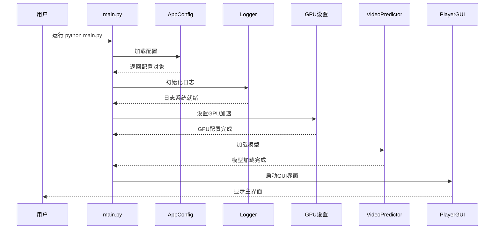
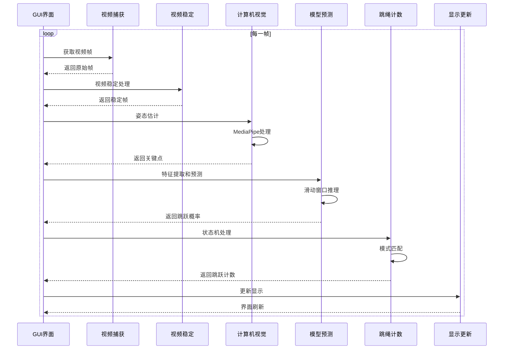
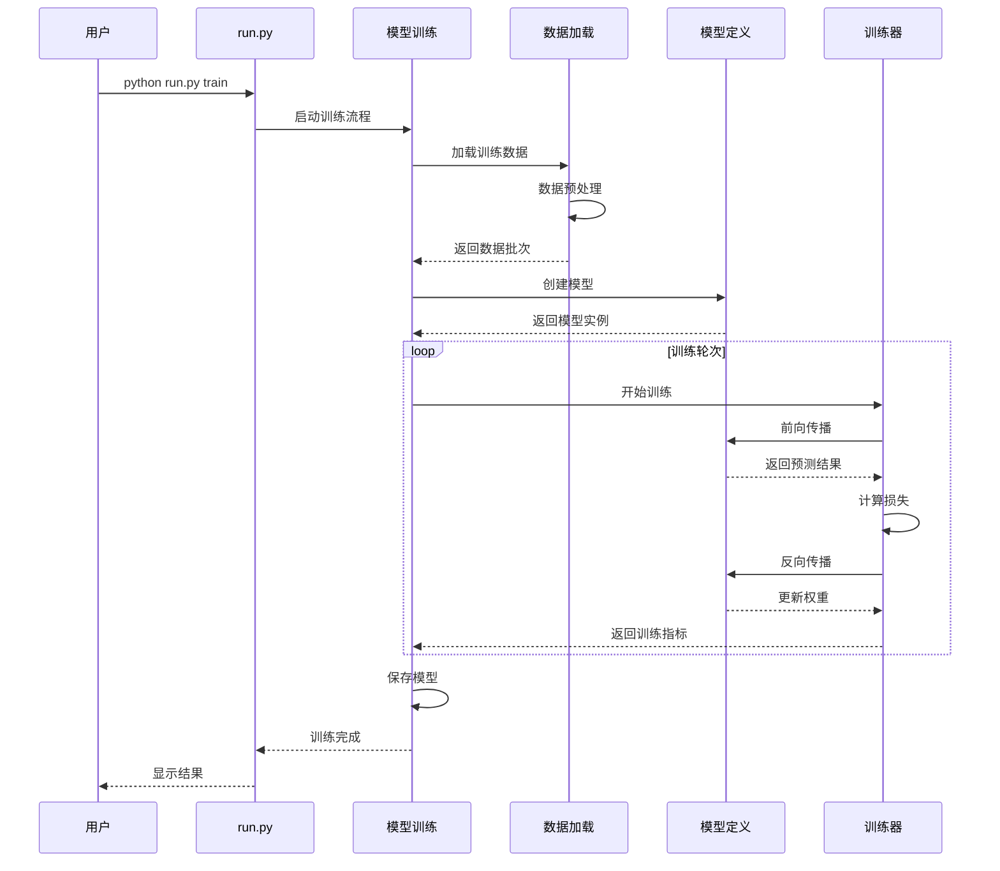
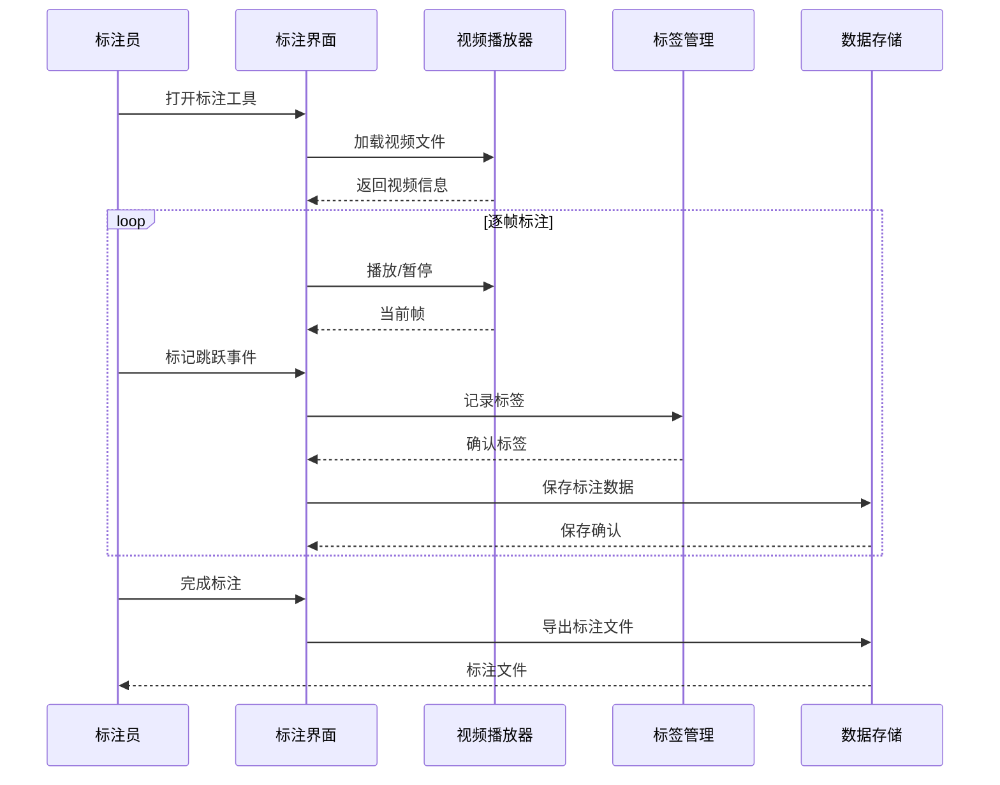
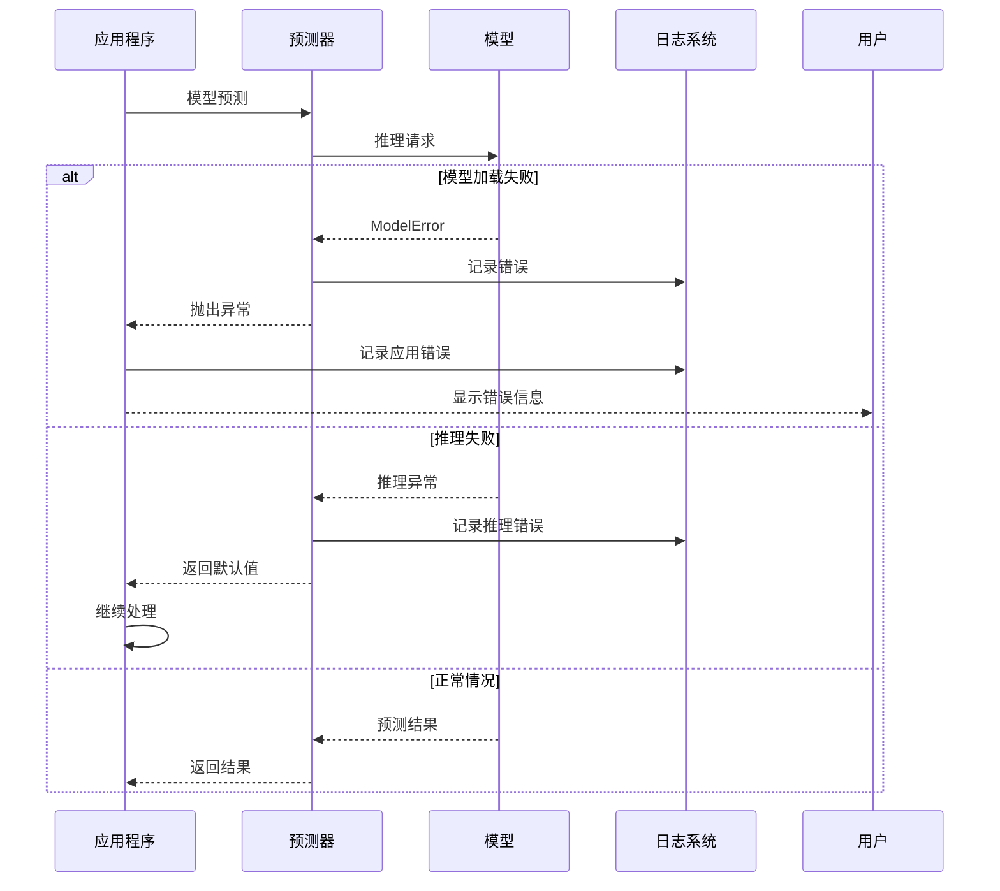
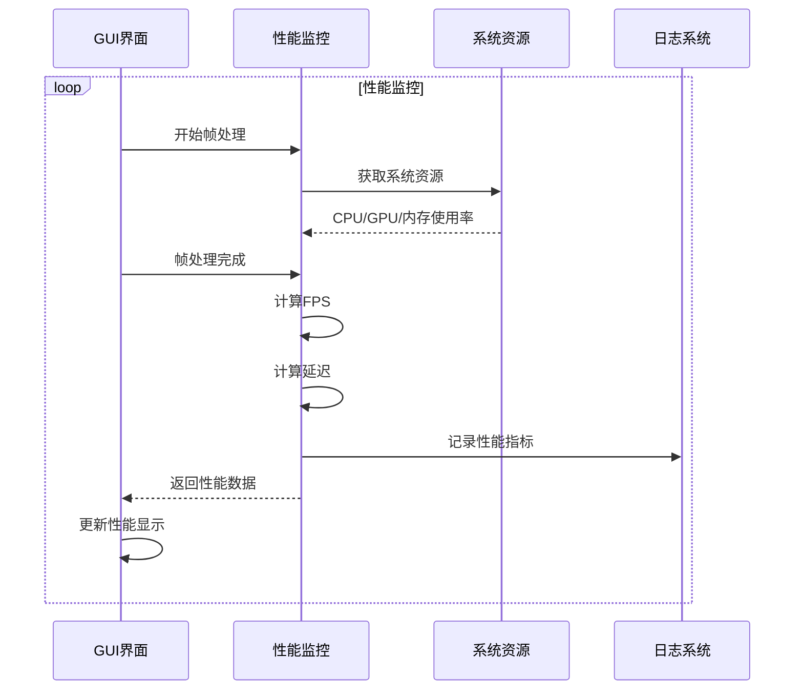
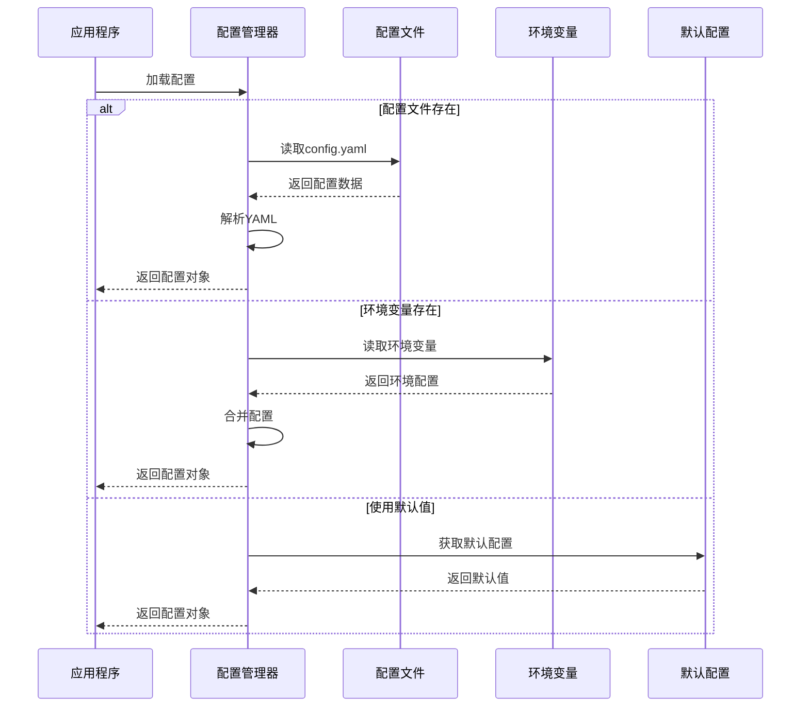

# RopeJumpCounter 序列图

## 应用启动序列

## 实时跳绳检测序列

## 模型训练序列

## 数据标注序列

## 错误处理序列

## 性能监控序列

## 配置管理序列

## 使用说明

### 1. **查看序列图**
- 在 GitHub 中直接查看
- 使用 Mermaid Live Editor 编辑
- 导出为图片格式

### 2. **更新序列图**
当代码逻辑变更时，记得同步更新相应的序列图。

### 3. **添加新序列图**
对于新的功能模块，可以按照相同的格式添加序列图。

### 4. **最佳实践**
- 保持图表简洁明了
- 突出关键交互点
- 包含错误处理流程
- 标注重要的时序关系 