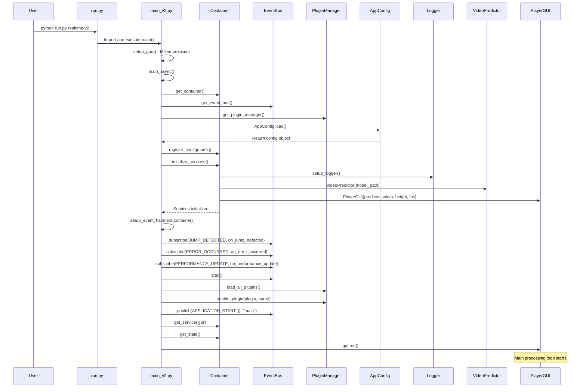
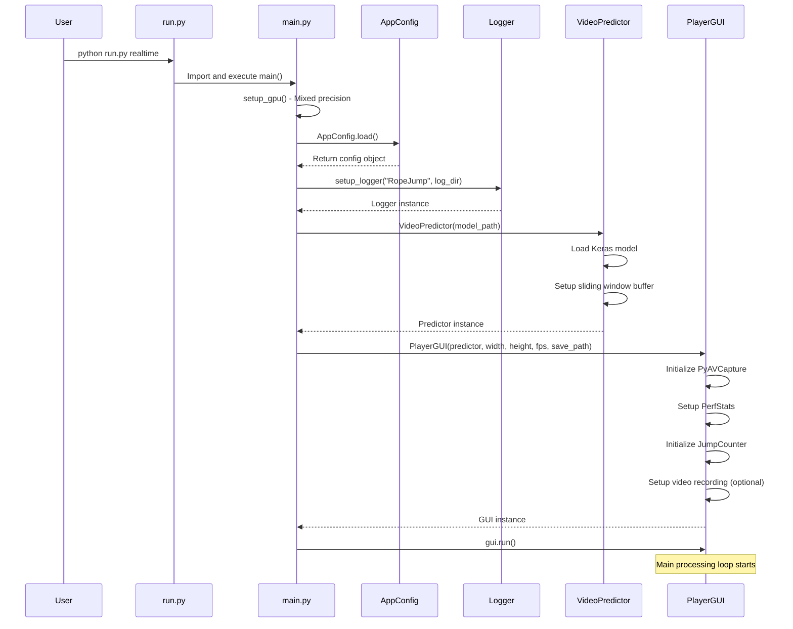
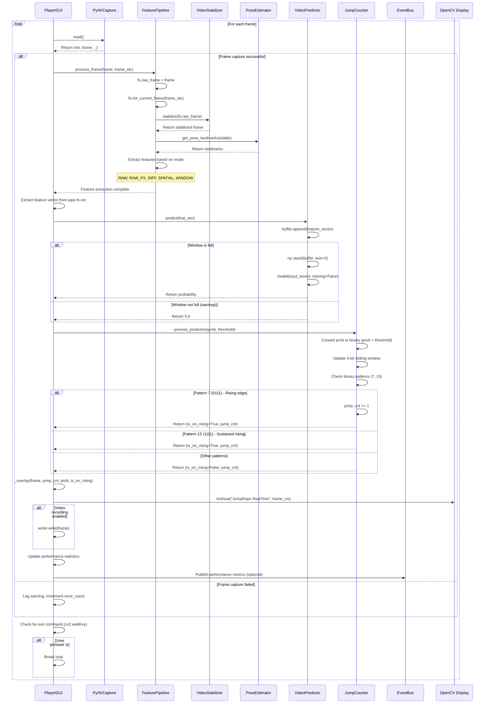
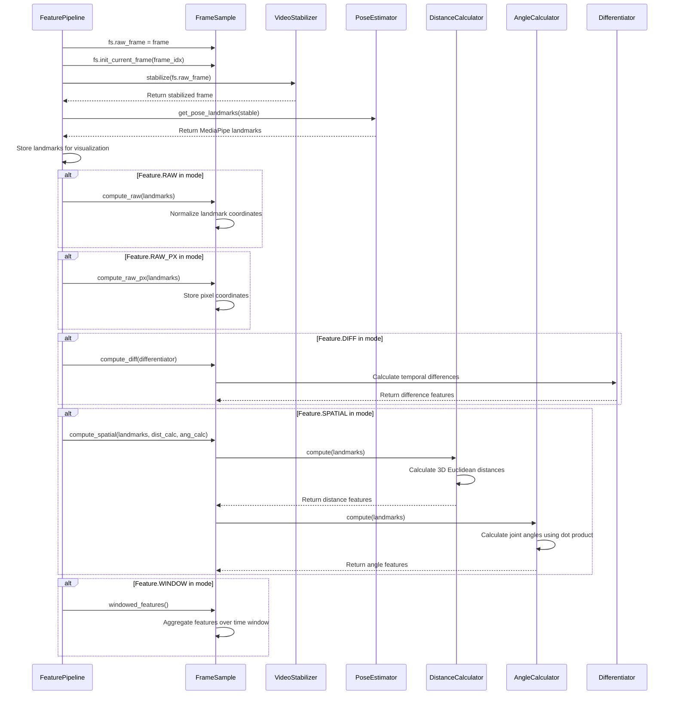
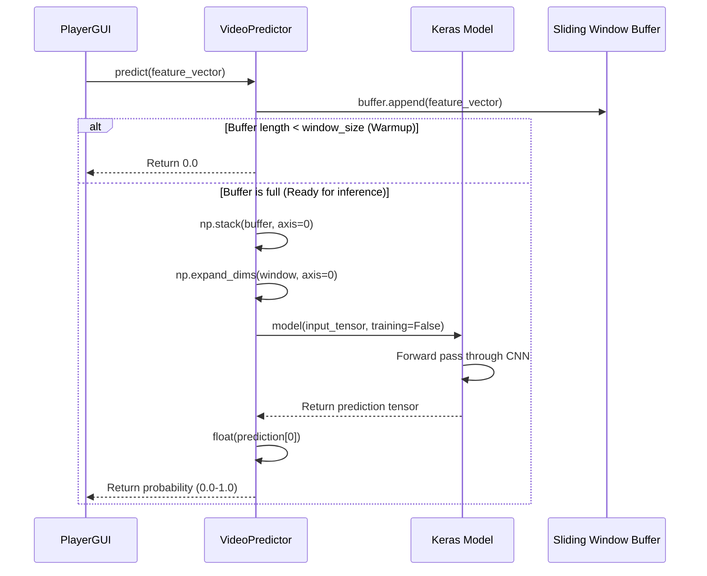
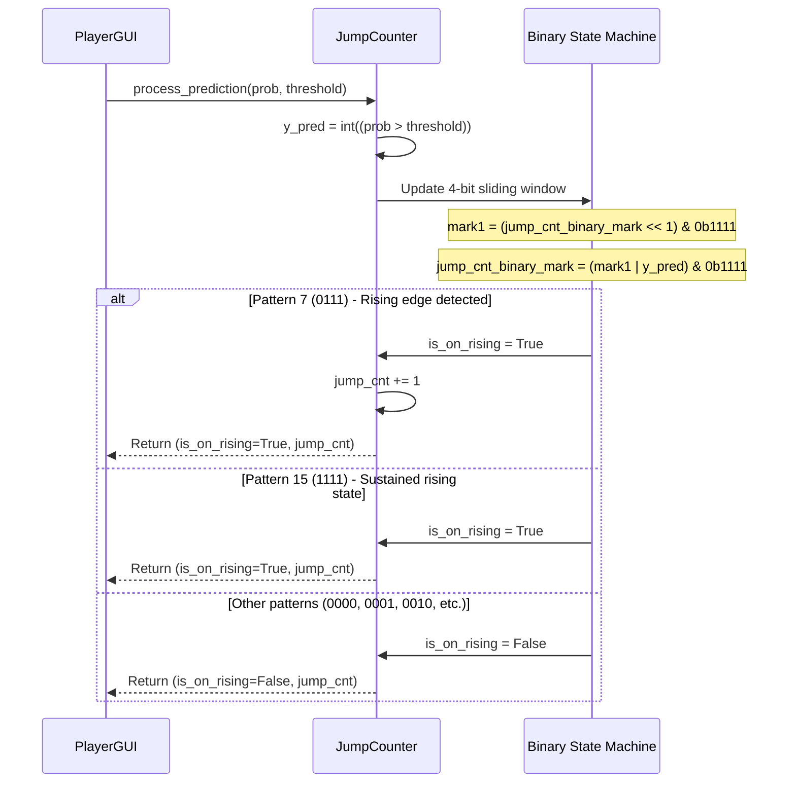
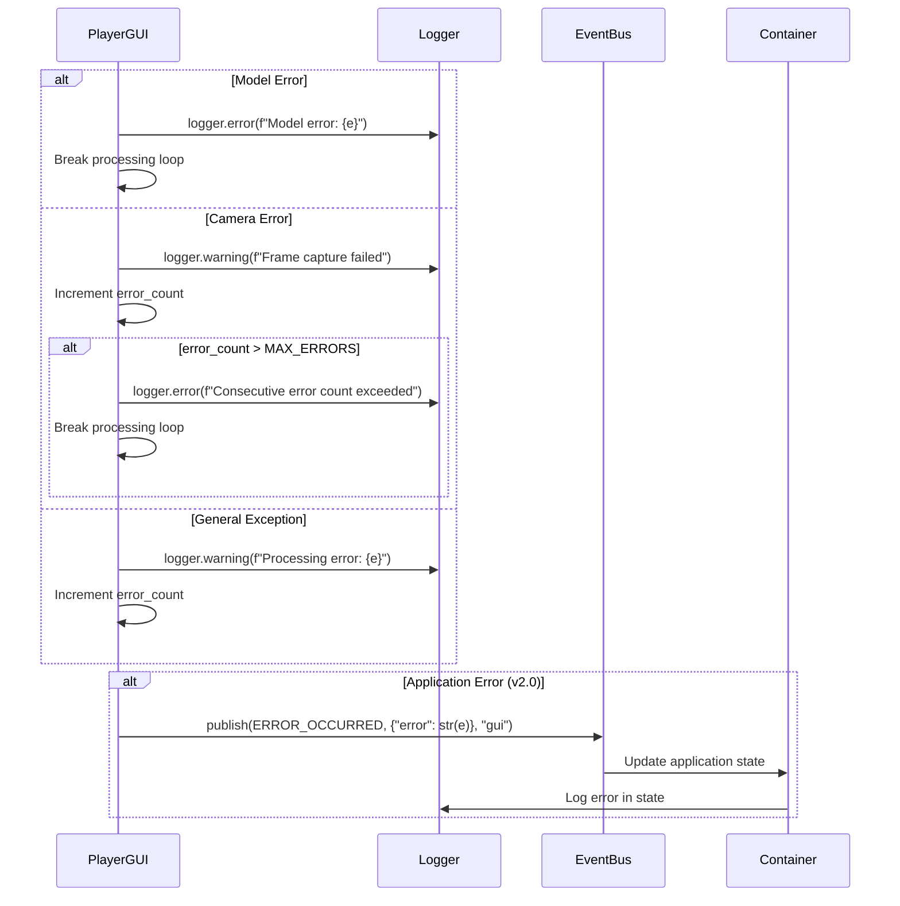
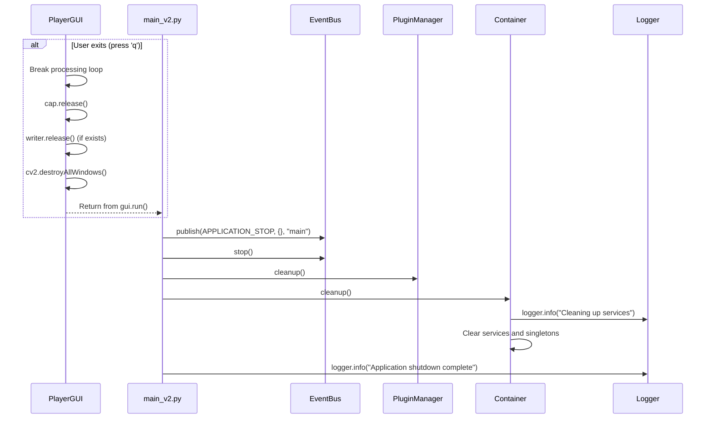
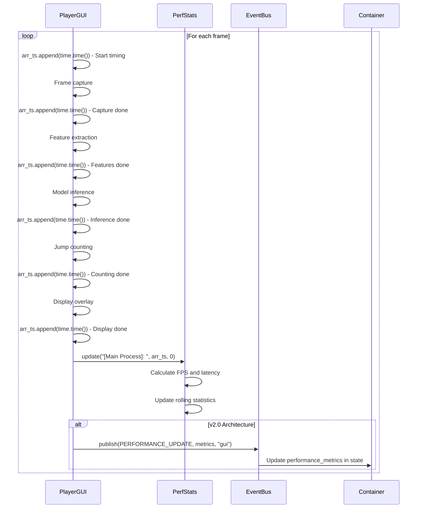

# RopeJumpCounter Sequence Diagrams

## Application Startup Sequence (v2.0 Architecture)

## Application Startup Sequence (Original Architecture)

## Real-time Frame Processing Sequence

## Feature Extraction Pipeline Sequence

## Model Inference Sequence

## Jump Detection State Machine Sequence

## Error Handling Sequence

## Application Shutdown Sequence (v2.0)

## Performance Monitoring Sequence

## Usage Instructions

### 1. **View Sequence Diagrams**
- View directly in GitHub
- Use Mermaid Live Editor for editing
- Export as image format

### 2. **Update Sequence Diagrams**
When code logic changes, remember to synchronize the corresponding sequence diagrams.

### 3. **Add New Sequence Diagrams**
For new functional modules, you can add sequence diagrams following the same format.

### 4. **Best Practices**
- Keep diagrams concise and clear
- Highlight key interaction points
- Include error handling flows
- Annotate important timing relationships

### 5. **Integration with Architecture**
These sequence diagrams complement the architecture diagrams by showing:
- **Dynamic behavior** of system components
- **Temporal relationships** between operations
- **Error handling** scenarios
- **Performance bottlenecks** identification

### 6. **Maintenance Guidelines**
- **Version control**: Include sequence diagrams in version control
- **Code synchronization**: Update diagrams when code changes
- **Review process**: Include diagram review in code reviews
- **Documentation**: Reference sequence diagrams in API documentation 